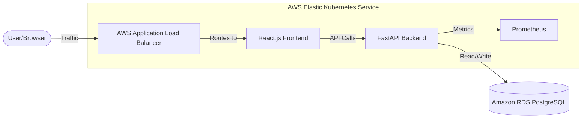
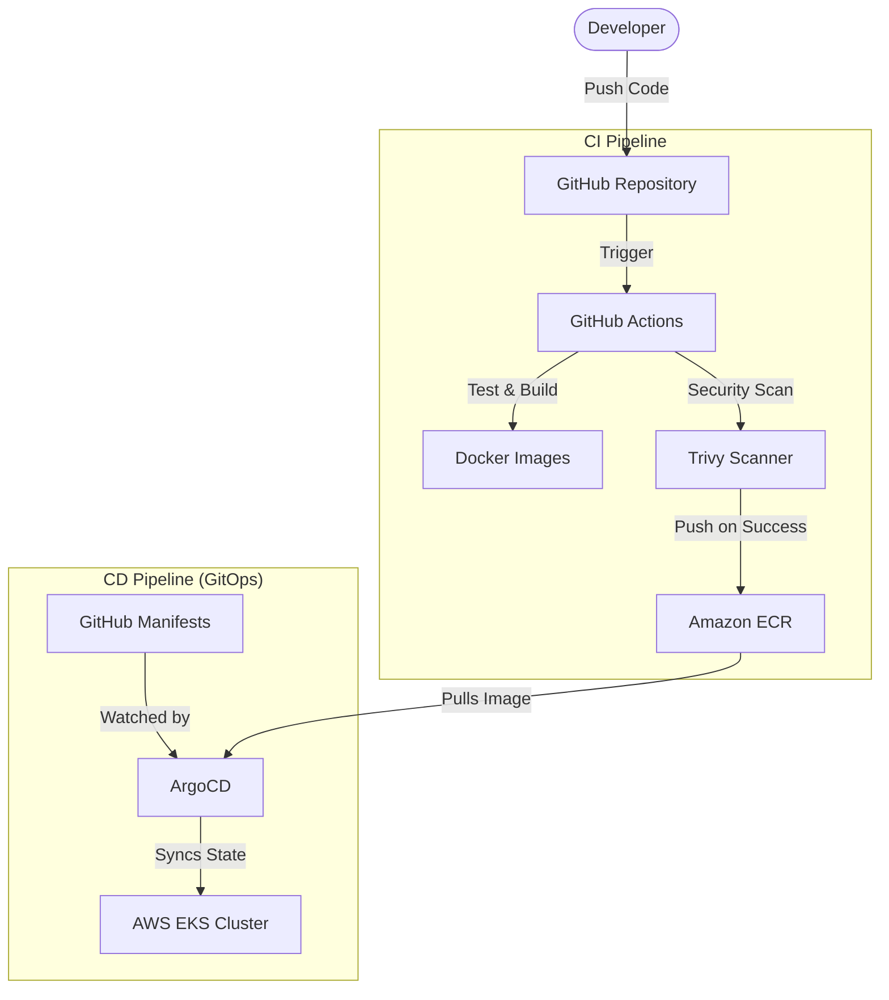
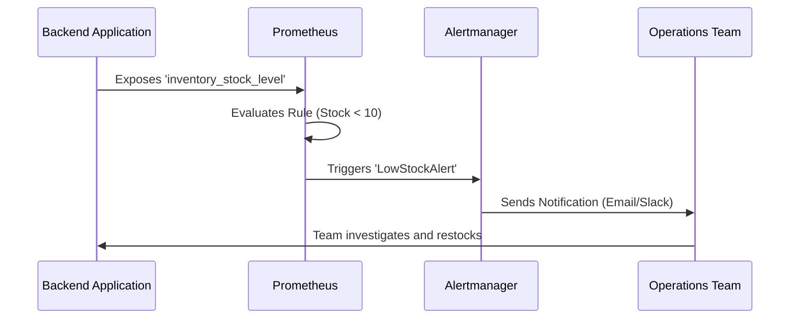

# Three-Tier Inventory Management System with AIOps-Style Alerts

## Project Overview

This project is a complete, production-ready inventory management system. It is designed to demonstrate how modern software is built, deployed, and monitored using DevOps best practices.

Whether you are a beginner looking to understand the DevOps lifecycle or a professional reviewing architectural patterns, this guide will walk you through every component step-by-step. The system tracks products, suppliers, and stock levels, and features automated "AIOps-style" alerts that notify administrators before critical issues happen (like running out of stock).

***

## High-Level Architecture

The system is built on a classic three-tier architecture and deployed on Amazon Web Services (AWS) using Kubernetes (EKS).

### 1. Application Architecture



### 2. DevOps and CI/CD Workflow



***

## Technology Stack

The project uses industry-standard tools to ensure scalability, security, and reliability.

| Category           | Technology Used              | Purpose                                                                     |
| :----------------- | :--------------------------- | :-------------------------------------------------------------------------- |
| **Frontend**       | React.js (Vite), Chakra UI   | Provides a responsive dashboard for inventory management.                   |
| **Backend**        | FastAPI (Python), SQLAlchemy | Handles business logic, database operations, and exposes metrics.           |
| **Database**       | Amazon RDS (PostgreSQL)      | Stores persistent data outside the Kubernetes cluster for safety.           |
| **Infrastructure** | Terraform                    | Provisions the VPC, EKS cluster, RDS, and IAM roles automatically.          |
| **Containers**     | Docker                       | Packages the application code into lightweight, runnable images.            |
| **CI/CD**          | GitHub Actions               | Automates the building, scanning, and pushing of code.                      |
| **GitOps**         | ArgoCD                       | Ensures the Kubernetes cluster always matches the configurations in GitHub. |
| **Observability**  | Prometheus, Grafana          | Collects system metrics and displays them on visual dashboards.             |

***

## Project Structure

A clean directory structure helps keep the code organized. Here is how this project is laid out:

```text
.
├── .github/workflows/    # Contains the CI/CD Pipeline configuration
├── app/                  
│   ├── backend/          # Python API source code and Dockerfile
│   └── frontend/         # React.js source code and Dockerfile
├── infra/                # Terraform infrastructure code and Prometheus configs
├── manifests/            # Kubernetes YAML files used by ArgoCD
└── docs/                 # Documentation and Load Testing scripts
```

***

## Step-by-Step Setup Guide

This guide is broken down into six phases. You can run the application locally first, and then deploy it to the cloud.

### Phase 1: Local Development

Before deploying to the cloud, you can test the entire system on your local machine using Docker.

1. Ensure Docker and Docker Compose are installed.
2. Run the following command in the root directory:
   ```bash
   docker-compose up --build
   ```
3. Access the services:
   - Frontend Dashboard: <http://localhost:3000>
   - Backend API: <http://localhost:8000>
   - Prometheus Metrics: <http://localhost:9090>

### Phase 2: Cloud Infrastructure Provisioning

We use Terraform to create the required AWS resources (VPC, EKS, RDS).

1. Navigate to the infrastructure folder:
   ```bash
   cd infra
   ```
2. Initialize Terraform to download necessary plugins:
   ```bash
   terraform init
   ```
3. Review the infrastructure plan:
   ```bash
   terraform plan
   ```
4. Apply the configuration (you will be prompted to provide a secure database password):
   ```bash
   terraform apply -var="db_password=YourSecurePassword"
   ```

### Phase 3: Continuous Integration (CI)

The project includes a GitHub Actions workflow located in `.github/workflows/ci-cd.yml`.
Every time you push code to the `main` branch, the pipeline will automatically:

1. Build the Frontend and Backend Docker images.
2. Scan the images for security vulnerabilities using **Trivy**.
3. Push the secure images to Amazon ECR.
4. Update the Kubernetes manifests with the new image tags.

### Phase 4: GitOps Deployment (CD)

Instead of manually applying Kubernetes files, we use ArgoCD.

1. Install ArgoCD on your EKS cluster.
2. Apply the main ArgoCD application file:
   ```bash
   kubectl apply -f manifests/argocd-app.yaml
   ```
3. ArgoCD will now continuously monitor your `manifests/` folder in GitHub and automatically deploy any changes to your cluster.

### Phase 5: Observability and AIOps-Style Alerts

The system is configured to monitor itself and alert administrators if something goes wrong.



**Configured Alerts:**

- **LowStockAlert:** Triggers if any product's stock falls below 10 units.
- **HighApiLatency:** Triggers if the backend API takes longer than 500 milliseconds to respond.
- **HighApiErrorRate:** Triggers if more than 5% of API requests result in a 5xx server error.

### Phase 6: Load Testing and Validation

To verify that the system handles traffic well and that alerts trigger correctly, we use `k6`.

1. Install `k6` on your machine.
2. Run the load test script against your Load Balancer URL:
   ```bash
   k6 run -e BASE_URL=http://your-alb-dns-address.com docs/load-test.js
   ```
3. Open Grafana to watch the metrics spike and confirm that Alertmanager sends the appropriate warnings.

***

## Security Practices Included

- **Image Scanning:** Trivy blocks deployments if critical vulnerabilities are found in Docker images.
- **Network Isolation:** The RDS database is placed in a private subnet, accessible only by the EKS nodes.
- **Least Privilege Access:** AWS IAM Roles for Service Accounts (IRSA) ensure pods only have the exact permissions they need.
- **Secrets Management:** Sensitive data like database passwords are kept out of plain text using Kubernetes Secrets.

***

## License

This project is licensed under the MIT License.

***

## Why This Project Stands Out

While many beginners build basic three-tier inventory apps focusing only on simple database operations (CRUD), this project is fundamentally different. It transforms a standard application into a **fully production-grade, cloud-native system** deployed on AWS.

Here is why this project makes a strong impact for AWS DevOps Engineer roles in 2026:

### 1. Beyond Basic App Development

Instead of manual setups, this project uses **Terraform** (Infrastructure as Code) to automatically provision enterprise-level AWS resources, including a secure VPC, an EKS cluster, an RDS PostgreSQL database, and strict IAM roles.

### 2. True GitOps Deployment

Rather than pushing code manually, this system uses **ArgoCD** for automated, auditable deployments. The Kubernetes cluster automatically syncs with the GitHub repository, ensuring that what is in the code is exactly what runs in production.

### 3. AIOps-Style Intelligent Alerting

This is the core differentiator. Using **Prometheus and Grafana**, the system does not just passively monitor metrics. It actively tracks custom application data (like `inventory_stock_level`) and triggers proactive, AIOps-style alerts.

- **Self-Healing:** If an API experiences high latency or stock runs low, the system can automatically scale pods via Horizontal Pod Autoscaler (HPA) or send real-time notifications via AWS SNS.
- **Result:** It simulates real-world scenarios, such as *"reducing simulated stock-out incidents through automated alerts."*

### 4. Enterprise-Ready Security

The project incorporates serious security practices that recruiters look for:

- **Trivy Image Scanning** in the CI pipeline to catch vulnerabilities before deployment.
- **Kubernetes Secrets / AWS Secrets Manager** for secure credential handling.
- **Least-Privilege IAM Roles (IRSA)** to ensure pods only access what they absolutely need.

**The Takeaway:**
By combining Terraform, AWS EKS, GitOps, observability, and proactive AIOps, this single project proves that you understand end-to-end system ownership, reliability engineering, and cost optimization. It sets your profile apart from hundreds of generic projects and gives you a powerful, production-ready system to confidently discuss in interviews.

***

## Enterprise Enhancements Implemented

To ensure this project meets 2026 production standards, several advanced DevOps, Security, and Cloud FinOps enhancements have been implemented across the codebase:

| Feature Domain          | Normal Inventory Projects                                    | My Implementation                                                                                                                                            |
| :---------------------- | :----------------------------------------------------------- | :----------------------------------------------------------------------------------------------------------------------------------------------------------------------- |
| **Infrastructure**      | Manually clicking through AWS Console or using basic Docker. | Fully automated with **Terraform**, using remote S3 state and DynamoDB locking to prevent infrastructure corruption.                                                     |
| **Compute & Cost**      | Standard x86 EC2 instances with high data transfer fees.     | **Graviton (ARM64)** processors for 20% better price-performance, **Spot Fleet** for stateless pods, and **VPC Endpoints** to cut NAT Gateway costs.                     |
| **Deployment (CD)**     | Pushing code via manual `kubectl apply` commands.            | **GitOps with ArgoCD** that automatically and securely syncs the Kubernetes cluster to match the GitHub repository state.                                                |
| **Security & IAM**      | Long-lived AWS access keys and pods running as `root`.       | **OIDC (OpenID Connect)** for temporary CI/CD credentials, **IRSA** (IAM Roles for Service Accounts) for least-privilege, and unprivileged Docker containers.            |
| **Monitoring & Alerts** | No monitoring, or just basic AWS CloudWatch graphs.          | **Prometheus & Grafana** for custom metrics (e.g., `inventory_stock_level`) with **AIOps-style alerts** that trigger auto-scaling or notifications before issues happen. |
| **Kubernetes Network**  | Flat network where any pod can talk to any database.         | **Zero Trust Network Policies** with Default Deny rules, ensuring the frontend can only communicate with the backend API.                                                |
| **Application Logic**   | Basic CRUD operations that fail if two users buy at once.    | Production-ready **Row-level SQL Locking** (`with_for_update()`) to prevent race conditions and inventory overdraws during high traffic.                                 |
| **Infrastructure State** | Unsafe local Terraform state                     | Hardened Terraform configuration by migrating state to an **S3 Backend** with **DynamoDB locking** to prevent corruption during concurrent CI/CD runs.                         |

---

## Changelog

Below is a summary of the technical improvements and bug fixes applied to this project to reach production readiness:

### Application & Logic
* **Race Condition Fixes:** Added SQL row-level locking (`with_for_update()`) in `POST /orders` and `PUT /products` to prevent inventory overdraw and lost updates.
* **Frontend Resilience:** Implemented null-safe property access and optional chaining in React to prevent application crashes on missing data.
* **Metric Reliability:** Refactored the `/metrics` endpoint with dedicated session management and error handling to ensure monitoring availability.

### Security (Zero Trust)
* **Network Hardening:** Implemented strict Kubernetes **NetworkPolicies** to isolate the namespace and restrict traffic flow (e.g., only Frontend to Backend).
* **Workload Identity:** Configured **IRSA (IAM Roles for Service Accounts)** to grant pods fine-grained, temporary AWS permissions instead of using static keys.
* **Pod Security:** Enforced non-root execution and read-only filesystems in all deployment manifests.
* **Data Protection:** Enabled KMS encryption for EKS Secrets and RDS storage to secure data at rest.

### DevOps & CI/CD
* **Container Optimization:** Migrated to multi-stage Docker builds using unprivileged base images (`appuser` / `nginx-unprivileged`) to reduce attack surface and image size.
* **Pipeline Security:** Switched CI/CD authentication to **OIDC (OpenID Connect)**, eliminating the need for long-lived GitHub secrets.
* **Vulnerability Scanning:** Integrated **Trivy** into the CI pipeline to block builds containing critical or high CVEs.

### Cloud FinOps (Cost Control)
* **Graviton Migration:** Shifted EKS nodes and RDS instances to **ARM64 (Graviton)** for better price-performance.
* **Compute Savings:** Integrated **Spot Fleet** for stateless application pods, reducing compute costs by up to 70%.
* **Networking Efficiency:** Deployed **VPC Endpoints** (Interface & Gateway) to bypass NAT Gateway data processing fees for ECR and S3 traffic.

---

## Professional Inventory Upgrade

The application has now been enhanced from a basic single-table inventory screen into a more complete operator-facing inventory product for a single warehouse setup.

### New Product Experience
* **Multi-Screen UI:** The frontend now supports dedicated screens for **Dashboard**, **Products**, **Suppliers**, **Orders**, and **Inventory Movements**.
* **Professional Dashboard:** The dashboard includes KPI cards, low-stock visibility, and quick operational health insights.
* **Supplier Management:** Users can create and update supplier records directly from the UI instead of relying on demo auto-seeding.
* **Inventory Actions:** Products now support **sell**, **restock**, **edit**, and **archive** workflows in a cleaner operational layout.

### Better Inventory Logic
* **Archive Instead of Delete:** Products are archived from active inventory views while keeping business history safe.
* **Inventory Movement History:** Every important stock change is tracked through movement records such as `initial_stock`, `sale`, `restock`, and `adjustment`.
* **Stronger Validation:** Backend validation now enforces cleaner product, supplier, and order payloads.
* **Low-Stock Alignment:** Prometheus alerting now uses a low-stock count metric that matches the upgraded inventory semantics better than a fixed hardcoded threshold rule.

### Manual QA
* A step-by-step validation checklist is available in [manual-test-checklist.md](file:///d:/INTERN/DEVOPS/Three-Tier%20Inventory%20Management%20System%20with%20AIOps-Style%20Alerts/docs/manual-test-checklist.md) for local end-to-end verification.
